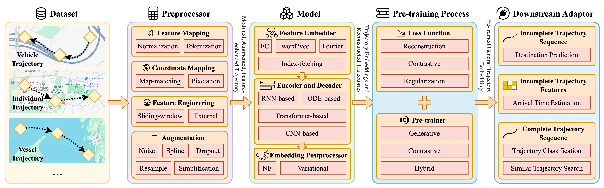
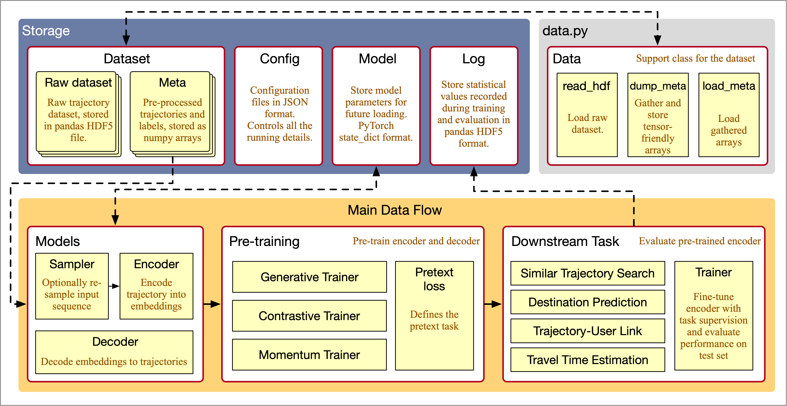

# UniTE: A Unified Pipeline for Pre-training Trajectory Embeddings

Companion code for the paper: *UniTE: A Survey and Unified Pipeline for Pre-training Spatiotemporal Trajectory Embeddings*

Preprint Paper: [arXiv](https://arxiv.org/abs/2407.12550)

## Introduction

UniTE is a modularized and unified pipeline for pre-training spatiotemporal trajectory embeddings. It aims to simplify the process of constructing and evaluating pre-training trajectory embedding methods.

UniTE decomposes the pre-training process of spatiotemporal trajectory embeddings into several key types of components to facilitate the implementation of existing and new pre-training methods. Under each type, we provide a set of common implementations, so that users can focus on the unique parts of their methods.

## Pipeline Overview



UniTE modularizes pre-training methods into five key types of components: dataset, preprocessor, model, pre-training process, and downstream adaptor.

1. **Dataset**
- Provides real-world spatiotemporal trajectory datasets for analysis and evaluation
- Includes contextual information like road networks covering the regions where trajectories were collected
- Contains different types of trajectories (vehicle, individual, vessel) with varying characteristics

2. **Preprocessor**
- Converts raw trajectory data into structured formats ready for encoding
- Includes four major operations:
  - Feature mapping (normalization, tokenization)
  - Coordinate mapping (map-matching, pixelation)
  - Feature engineering (sliding-window, external features)
  - Augmentation (noise addition, interpolation, dropout, etc.)

3. **Model**
- Contains the core learnable elements for trajectory embedding
- Consists of four sub-components:
  - Feature embedder: Maps trajectory point features to embedding space
  - Encoder: Converts preprocessed trajectories into embeddings
  - Decoder: Reconstructs trajectories from embeddings (optional)
  - Embedding postprocessor: Further transforms encoded embeddings (optional)

4. **Pre-training**
- Manages the training workflow and optimization
- Implements different pre-training frameworks (word2vec, auto-encoding, contrastive learning, etc.)
- Defines loss functions and training objectives

5. **Downstream Adaptor**
- Enables use of pre-trained embeddings in various downstream tasks
- Provides interfaces for fine-tuning or direct application of embeddings
- Facilitates evaluation and comparison of different methods

## Technical Overview



The UniTE framework consists of four main components as detailed below.

> Note that the technical implementation of the UniTE pipeline does not fully adhere to the theoretical design. This is mainly due to technical considerations, such as implementing some preprocessors within the `Data` class to enhance data loading efficiency.

- **Data Storage**: Manages raw trajectory data, preprocessed features, model checkpoints, and experiment configurations through the centralized `Data` class.
- **Neural Network Models**: Implements trajectory encoders, decoders, and data samplers as modular building blocks.
- **Pre-training**: Defines pretext tasks and training procedures for learning trajectory representations.
- **Downstream Tasks**: Evaluates learned representations on practical trajectory mining applications.

The following sections explain these components in detail.

### Data Storage

#### Raw Dataset

The raw trajectory datasets store the original trajectory sequences in `pandas HDF5Store` format. A small sample dataset is provided in the `/sample/chengdu.h5` file, which is also useful for quick debugging and also serves as a template for users to prepare their own datasets.

Each `HDF5` file contains one dataset, with three keys (dataframes) stored in one file:

- `trips`: The trajectory sequences.
- `trip_info`: Additional features related to each trajectory, such as user ID and class label.
- `road_info`: Information about the road network, such as the coordinates of each road segment.

The `read_hdf` function in the `Data` class loads the raw dataset and performs some basic processing.

#### Meta Data

Original trajectories are stored as `pandas DataFrame` for readability. However, they require extra pre-processing to be fed into neural networks. The pre-processed, tensor-friendly arrays, such as trajectories padded to the same maximum length, are stored as `numpy` binaries. Once saved, they can be quickly loaded from files, saving time during multiple experiments.

The `dump_meta` and `load_meta` functions in the `Data` class save and load metadata from files, respectively.

#### Configurations

Configuration files control all the parameters in experiments. These config files are stored in JSON or YAML format. `config/example.yaml` provides an example of the configuration file.

#### Cached Models

Learnable parameters in neural networks can be saved as files. Models trained under a specific experimental setting can be loaded without the need to re-train them.

#### Base Directory

All the cached meta data and model parameters are stored in a "base directory" specified in the `Data` class. When runing the code, the base directory can be specified by setting the system variable `META_PATH`.

### Models

Neural network models are classified into:

- **Samplers**: Re-sample the input trajectory sequences before passing them to the encoders. They are useful for achieving certain experimental settings, such as denoising autoencoding. Although called "sampler", you can define how the trajectories are processed as needed.

- **Encoders**: Encode and map trajectories into embeddings. Common RNN- and Transformer-based encoders are already implemented.
- **Decoders**: Recover embeddings back to trajectories. They serve generative pre-training tasks such as auto-encoding.

Implementing new models is straightforward, as long as the input and output format is followed. All model classes are located under the `/model` directory.

### Pre-training

#### Pre-trainer

Pre-trainers are classes that support the pre-training process. `/pretrain/trainer.py` includes commonly used pre-trainers.

- The `Trainer` class is an abstract class, implementing common functions: fetching mini-batches, feeding mini-batches into loss functions, saving, and loading pre-trained models.
- The `ContrastiveTrainer` class is for contrastive-style pre-training. Currently, it doesn't include any additional functions beyond the `Trainer` class.
- The `GenerativeTrainer` class is for generative-style pre-training. It includes a `generation` function to evaluate the generation accuracy of a trained encoder-decoder pair.
- The `MomentumTrainer` is a special version of contrastive-style pre-trainer, implementing a momentum training scheme with student-teacher pairs.
- The `NoneTrainer` is reserved for end-to-end training scenarios.

#### Pretext Loss

The loss defines the pretext task to pre-train the models. They are aligned with the specified pre-trainer. For example, as a generative pretext loss, `AutoReg` can only work with `GenerativeTrainer`.

As their names suggest, `contrastive_losses.py` and `generative_losses.py` store contrastive- and generative-style loss functions. The loss functions must adhere to two basic standards:

- They need to be a subclass of `torch.nn.Module`, as some loss functions may include extra discriminators or predictors.
- The `forward` function implements the loss's calculation.

Some widely used and state-of-the-art pretext losses are included. For contrastive losses, the Maximum Entropy Coding loss and the InfoNCE loss are included. For generative losses, the Auto-regressive loss and two Denoising Diffusion-based losses are included.

### Downstream Tasks

Four downstream tasks are included for evaluating the performance of pre-training representation methods. In `/downstream/trainer.py`, the `Classification` class implements the classification task, `Destination` implements the destination prediction task, `Search` implements the similar trajectory search task, and `TTE` implements the travel time estimation task.

You can also add your own tasks by implementing a new downstream trainer based on the abstract class `Trainer`. To add your own predictor for the downstream tasks, add a new model class in `/downstream/predictor.py`.

## Hands-on

### Fetch the Code

Download the code by running the following commands:

```bash
mkdir UniTE
cd UniTE
git clone https://github.com/Logan-Lin/UniTE.git
mv UniTE src
```

### Environment Setup

To install all the dependencies, we need to install PyTorch and PyTorch Geometric first, followed by the other dependencies listed in `requirements.txt`.

```bash
pip install torch torchvision torchaudio
pip install pyg_lib torch_scatter torch_sparse torch_cluster torch_spline_conv -f https://data.pyg.org/whl/torch-2.4.0+cu124.html
pip install -r src/requirements.txt
```

We suggest using some form of virtual environment to manage the dependencies. Here, we use Singularity to build a container for the project. `unite.def` is the Singularity definition file. To build the container, run the following command:

```bash
singularity build --nv --fakeroot unite.sif unite.def
```

### Data Preprocessing

Depending on what kind of data our pre-training process requires, some meta data need to be pre-processed by running the `data.py`. Here, we pre-process the sample Chengdu dataset into the `trip` meta data, which contains basic features of the trajectories.

First, we need to specify the location of the raw dataset and the directory to save the pre-processed meta data. You can adjust the `META_PATH` and `DATASET_PATH` based on your needs.

```bash
export META_PATH=cache
export DATASET_PATH=src/sample
```

Then, we can pre-process the dataset by running the following command:

```bash
singularity run --nv unite.sif src/data.py --name chengdu -t trip 
```

The pre-processed meta data will be saved in the `META_PATH` directory. Here, it will be saved as three files `cache/meta/chengdu/trip_{0,1,2}.npz`, representing the train/val/test sets.

### Prepare Configuration Files

The configuration file controls all the parameters in experiments. Here, suppose we want to pre-train a Transformer encoder for trajectory embedding with the pre-processed Chengdu dataset using auto-regressive loss and generative pre-trainer. 

First, we specify the dataset and the type of meta data to use:

```yaml
data:
  name: chengdu
  meta:
    - type: trip
```

Then, we desginate the encoder and decoder models as:

```yaml
models:
  # Transformer encoder for trajectory embedding
  - name: transformer_encoder
    config:
      # Base dimension for transformer model
      d_model: 64
      # Output embedding dimension
      output_size: 64
      # Discrete feature columns (road IDs)
      dis_feats: [1]
      # Number of unique values for each discrete feature
      num_embeds: [2505]
      # Continuous feature columns (e.g., time, distance)
      con_feats: [2]
    # Preprocessor for trajectory data
    preprocessor:
      # Type of preprocessor to use
      name: khop
      config:
        # Jump size for k-hop sampling
        jump: 2
        # Select every k-th point
        select: 1

  # Decoder for trajectory reconstruction
  - name: transformer_decoder
    config:
      # Input embedding dimension from encoder
      encode_size: 64
      d_model: 64
      hidden_size: 128
      num_layers: 2
      num_heads: 4
```

We also need to specify the pre-training process, including the loss function and the pre-trainer:

```yaml
pretrain:
  # Whether to load pre-trained weights
  load: false
  loss:
    # Autoregressive loss for trajectory reconstruction
    name: autoreg
    config:
      out_dis:
        # Output discrete features (road IDs)
        feats: [1]
        num_embeds: [2505]
      # Output continuous features
      out_con_feats: [2]
      latent_size: 64
      # Weights for discrete/continuous reconstruction loss
      dis_weight: 1.0
      con_weight: 1.0
  trainer:
    # Generative pre-training approach
    name: generative
    config:
      num_epoch: 5
      batch_size: 16
      lr: 1.0e-3
      # Indices for encoder/decoder meta features
      enc_meta_i: [0]
      rec_meta_i: [0]
```

Finally, we also want to evaluate the pre-trained model on the destination prediction task. Therefore, we need to specify the downstream task:

```yaml
downstream:
  # Destination prediction task
  - task: destination
    # Use first model (encoder) for prediction
    select_models: [0]
    # Use test set for evaluation
    eval_set: 2
    config:
      # Number of points to use for prediction
      pre_length: 1
      # Whether to fine-tune pre-trained model
      finetune: true
      num_epoch: 20
      batch_size: 16
      save_prediction: false
      lr: 1.0e-3
      # Early stopping patience
      es_epoch: 10
      meta_types:
        - trip
      # Meta feature indices for encoder and labels
      enc_meta_i: [0]
      label_meta_i: [0]
```

The result configuration file is also provided as `config/example.yaml`.

### Pre-training and Downstream Evaluation

To run the main script with the configuration file we just prepared, use the following command:

```bash
singularity run --nv unite.sif src/main.py -c src/config/example.yaml
```

### Explore Components

We present a simple example of how to run the UniTE pipeline above. There are other components implemented in the pipeline that you can utilize through preparing your own configuration files. You can even implement your own components and add them to the pipeline, as long as they follow the same interfaces.

To explore the components in the pipeline, the main entry in `main.py` is a good starting point. It breaks down the pipeline into several functions:

- **`parse_args`**: Parses command line arguments to obtain the configuration file path and CUDA device index. Sets the CUDA device environment variable and returns the parsed arguments and device string.
- **`load_data`**: Loads and initializes a dataset based on a configuration entry, returning a `Data` object with loaded statistics.
- **`create_model`**: Creates and returns a model instance based on the provided configuration, dataset, and model parameters. Raises an error if the model name is not recognized.
- **`create_preprocessor`**: Initializes and returns a data augmentation sampler based on the configuration. Raises an error if the preprocessor name is not recognized.
- **`create_loss_functions`**: Creates and returns a list of loss functions based on configuration entries and model instances. Handles both single and multiple loss configurations.
- **`create_pretrainer`**: Initializes and returns a pretraining trainer based on the configuration, dataset, models, and loss function. Raises an error if the trainer name is not recognized.
- **`setup_pretraining`**: Sets up and executes model pretraining based on the configuration, returning the pretraining trainer and pretrained models.
- **`run_downstream_tasks`**: Executes downstream tasks after pretraining, iterating over each task configuration and handling model loading and evaluation.
- **`setup_downstream_task`**: Sets up a downstream task trainer based on the configuration, returning the initialized trainer. Raises an error if the task name is not recognized.

## Contacts

If you have any questions, suggestions, or encounter any problems regarding the pipeline, feel free to contact me directly. My contact information is available on my [homepage](https://www.yanlincs.com).